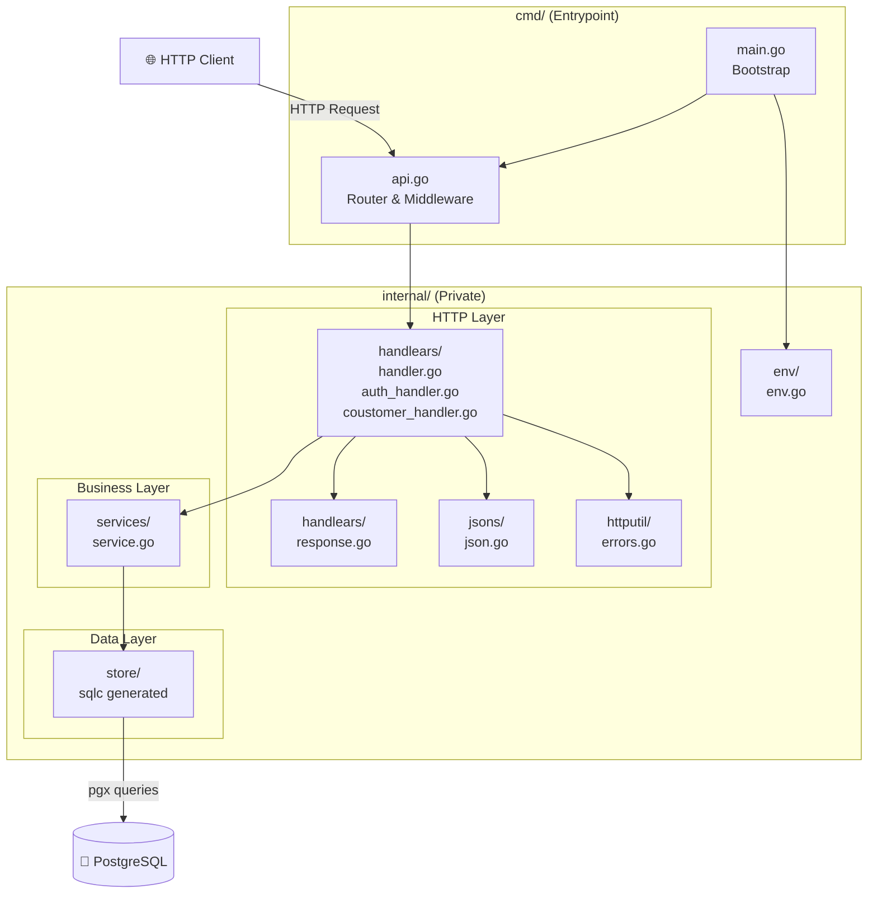
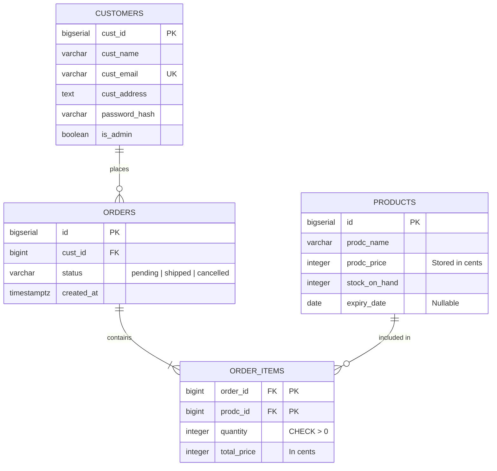
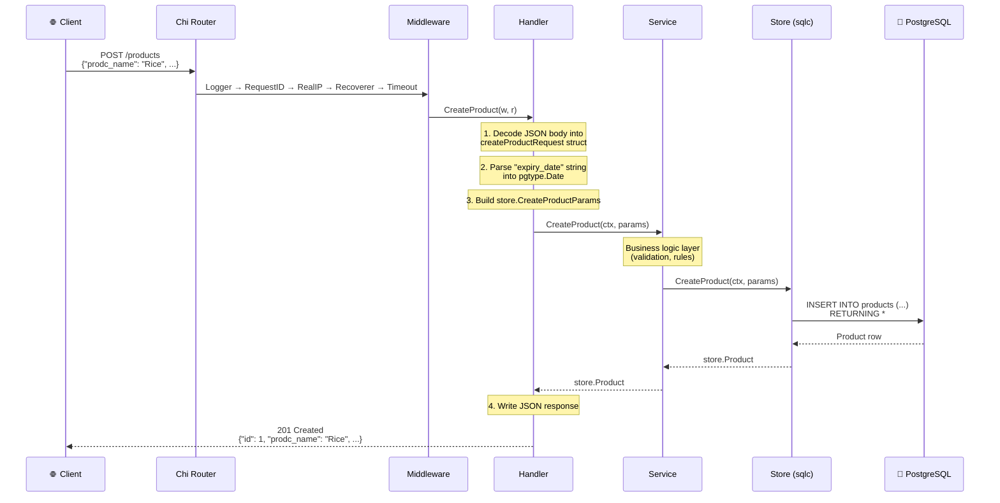
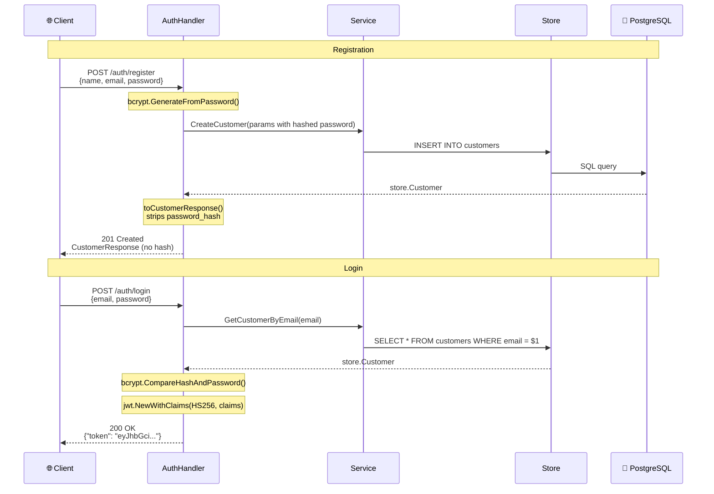
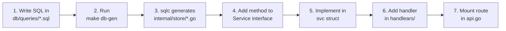

# WealthArena API — Architecture Documentation

> A Go REST API for managing products, customers, orders, and authentication, built with **Clean Architecture** principles.

---

## Table of Contents

- [Overview](#overview)
- [Tech Stack](#tech-stack)
- [Project Structure](#project-structure)
- [Architecture &amp; Design Principles](#architecture--design-principles)
- [Layer Diagram](#layer-diagram)
- [Database Schema (ERD)](#database-schema-erd)
- [Request Lifecycle — Step-by-Step Flow](#request-lifecycle--step-by-step-flow)
- [Package Breakdown](#package-breakdown)
- [API Endpoints](#api-endpoints)
- [Development Workflow](#development-workflow)

---

## Overview

**WealthArena API** (`wealtharena.in/api`) is a RESTful backend service built in Go. It provides CRUD operations for products, customers, and orders backed by PostgreSQL, with JWT-based authentication and bcrypt password hashing. The codebase uses **sqlc** for type-safe database queries and **chi** for HTTP routing.

---

## Tech Stack

| Layer           | Technology                                                               |
| --------------- | ------------------------------------------------------------------------ |
| Language        | Go 1.26                                                                  |
| HTTP Router     | [chi v5](https://github.com/go-chi/chi)                                     |
| Database        | PostgreSQL                                                               |
| DB Driver       | [pgx v5](https://github.com/jackc/pgx) (connection pooling via `pgxpool`) |
| Code Generation | [sqlc](https://sqlc.dev/)                                                   |
| Auth            | [golang-jwt/jwt v5](https://github.com/golang-jwt/jwt) + [bcrypt](https://pkg.go.dev/golang.org/x/crypto/bcrypt) |
| Env Management  | [godotenv](https://github.com/joho/godotenv)                                |
| Hot Reload      | [Air](https://github.com/air-verse/air)                                     |

---

## Project Structure

```
go_backend/
├── cmd/                        # Application entrypoint
│   ├── main.go                 # Bootstrap: env, DB, logger, start server
│   └── api.go                  # HTTP server, router, middleware, route mounting
│
├── internal/                   # Private application code (Go convention)
│   ├── env/                    # Environment variable helpers
│   │   └── env.go
│   ├── handlears/              # HTTP handlers (controllers)
│   │   ├── handler.go          # Product handlers
│   │   ├── auth_handler.go     # Auth handlers (login, register)
│   │   ├── coustomer_handler.go # Customer handlers (list, get)
│   │   └── response.go         # Response DTOs (strips sensitive fields)
│   ├── httputil/               # Structured error handling
│   │   └── errors.go           # CustomError type with error constructors
│   ├── jsons/                  # JSON response writer
│   │   └── json.go
│   ├── services/               # Business logic layer
│   │   └── service.go
│   └── store/                  # Data access layer (sqlc-generated)
│       ├── db.go               # DB interface & Queries struct
│       ├── models.go           # Go structs for DB tables
│       ├── products.sql.go     # Generated product queries
│       ├── customers.sql.go    # Generated customer queries
│       ├── orders.sql.go       # Generated order queries
│       ├── order_items.sql.go  # Generated order item queries
│       └── copyfrom.go         # Batch insert support
│
├── db/                         # Database definitions
│   ├── migrations/             # SQL migration files
│   │   └── 0001_init.up.sql
│   └── queries/                # SQL query files (sqlc input)
│       ├── products.sql
│       ├── customers.sql
│       ├── orders.sql
│       └── order_items.sql
│
├── docs/                       # Documentation
├── .air.toml                   # Air hot-reload config
├── .env                        # Environment variables
├── Makefile                    # Dev commands
├── sqlc.yml                    # sqlc configuration
├── go.mod                      # Go module definition
└── go.sum                      # Dependency checksums
```

---

## Architecture & Design Principles

### 1. Layered (Clean) Architecture

The code is organized into **three distinct layers**, each with a single responsibility:

```
┌─────────────────────────────────────────┐
│           HTTP Layer (handlears)         │  ← Accepts requests, returns responses
├─────────────────────────────────────────┤
│         Business Logic (services)       │  ← Rules, validation, orchestration
├─────────────────────────────────────────┤
│           Data Access (store)           │  ← Talks to PostgreSQL via sqlc
└─────────────────────────────────────────┘
```

**Why?** Each layer only knows about the layer directly below it. Handlers don't know SQL exists. Services don't know about HTTP. This makes the code **testable**, **swappable**, and **maintainable**.

### 2. Dependency Inversion (Interface-based)

The `services` package defines a `Service` **interface**, not a concrete struct:

```go
type Service interface {
    // Products
    ListProduct(ctx context.Context) ([]store.Product, error)
    CreateProduct(ctx context.Context, req store.CreateProductParams) (store.Product, error)
    GetProduct(ctx context.Context, id int64) (store.Product, error)
    // Customers
    CreateCustomer(ctx context.Context, req store.CreateCustomerParams) (store.Customer, error)
    GetCustomerByEmail(ctx context.Context, email string) (store.Customer, error)
    ListCustomers(ctx context.Context) ([]store.Customer, error)
    // ... and more
}
```

Handlers depend on this **interface**, not the implementation. This means:

- You can swap the real service with a **mock** for testing
- The handler doesn't care _how_ products are fetched — just _that_ they can be

### 3. Separation of Concerns

| Package        | Responsibility                      | Knows about             |
| -------------- | ----------------------------------- | ----------------------- |
| `cmd/`       | Bootstrap & wiring                  | All packages            |
| `handlears/` | HTTP request/response handling       | `services`, `store` |
| `services/`  | Business logic                      | `store`               |
| `store/`     | Database queries (auto-generated)   | PostgreSQL              |
| `jsons/`     | JSON response utility               | `net/http`            |
| `env/`       | Environment variable reading        | `os`                  |
| `httputil/`  | Structured error types & builders   | `net/http`            |

### 4. Code Generation over Boilerplate

Instead of writing repetitive database code by hand, **sqlc** reads your `.sql` files and generates **type-safe Go code** automatically. This eliminates an entire class of bugs (typos, type mismatches) and keeps the store layer in sync with the schema.

### 5. Go's `internal/` Convention

Everything under `internal/` is **invisible to external packages**. This is enforced by the Go compiler — no one importing `wealtharena.in/api` can access `internal/store` or `internal/services`. This protects your implementation details.

---

## Layer Diagram



---

## Database Schema (ERD)



### Database View: `product_inventory`

A **view** that calculates real-time available stock by joining `products` with `order_items`:

```sql
available_inventory = stock_on_hand - SUM(order_items.quantity)
```

---

## Request Lifecycle — Step-by-Step Flow

Here's what happens when a client calls **`POST /products`**:



### Step-by-step breakdown:

| Step        | Layer          | What Happens                                                    |
| ----------- | -------------- | --------------------------------------------------------------- |
| **1** | `chi Router` | Matches `POST /products` to `productHandlear.CreateProduct` |
| **2** | `Middleware` | Logs request, assigns Request ID, sets 60s timeout              |
| **3** | `Handler`    | Decodes JSON body →`createProductRequest` (string date)      |
| **4** | `Handler`    | Parses `"2025-12-31"` → `pgtype.Date`                      |
| **5** | `Handler`    | Builds `store.CreateProductParams` struct                     |
| **6** | `Service`    | Receives params, applies business rules, calls store            |
| **7** | `Store`      | Executes `INSERT INTO products (...) RETURNING *` via pgx     |
| **8** | `Handler`    | Sends `201 Created` with product JSON via `jsons.Write()`   |

---

## Package Breakdown

### `cmd/main.go` — Application Bootstrap

```
Load .env → Read DATABASE_URL → Setup slog logger → Connect pgxpool → Start server
```

Key decisions:

- Uses `slog` (Go's structured logger) for production-grade logging
- Uses `pgxpool` for **connection pooling** (not single connections)
- Graceful exit with `os.Exit(1)` on fatal errors

### `cmd/api.go` — Server & Router

Wires everything together:

1. Creates `store.Queries` from the connection pool
2. Creates `services.Service` from queries
3. Creates `handlears` from the service
4. Mounts routes with middleware

**Middleware stack** (applied in order):

| Middleware    | Purpose                                         |
| ------------- | ----------------------------------------------- |
| `Logger`    | Logs every request (method, path, duration)     |
| `RequestID` | Assigns unique ID to each request               |
| `RealIP`    | Extracts real client IP behind proxies          |
| `Recoverer` | Catches panics, returns 500 instead of crashing |
| `Timeout`   | Cancels requests after 60 seconds               |

### `internal/handlears/` — HTTP Handlers

Three handler files, each owning a domain:

| File | Struct | Routes | Description |
|------|--------|--------|-------------|
| `handler.go` | `handlears` | `/products` | Product CRUD |
| `auth_handler.go` | `AuthHandler` | `/auth` | Login (JWT) & Register (bcrypt) |
| `coustomer_handler.go` | `CoustomerHandlears` | `/coustomer` | Customer listing & lookup |

- Uses **request DTOs** — e.g. `createProductRequest` handles date string → `pgtype.Date` conversion
- Uses **response DTOs** via `response.go` — strips sensitive fields like `password_hash` before sending to the client

### `internal/handlears/response.go` — Response DTOs

Maps sqlc-generated models to safe API responses:

```go
// CustomerResponse omits PasswordHash — never leaks in API responses
type CustomerResponse struct {
    CustID      int64  `json:"cust_id"`
    CustName    string `json:"cust_name"`
    CustEmail   string `json:"cust_email"`
    CustAddress string `json:"cust_address"`
    IsAdmin     bool   `json:"is_admin"`
}
```

Helper functions `toCustomerResponse()` and `toCustomerResponseList()` handle the mapping. This pattern is necessary because the `store.Customer` struct is sqlc-generated and cannot be modified.

### `internal/httputil/errors.go` — Structured Errors

Defines a `CustomError` type implementing the `error` interface with structured fields:

```go
type CustomError struct {
    BaseErr     error                  `json:"-"`
    StatusCode  int                    `json:"status_code"`
    Message     string                 `json:"message"`
    UserMessage string                 `json:"user_message"`
    ErrType     string                 `json:"error_type"`
    ErrCode     string                 `json:"error_code"`
    Retryable   bool                   `json:"retryable"`
    Metadata    map[string]interface{} `json:"metadata,omitempty"`
}
```

Convenience constructors: `NewBadRequest()`, `NewNotFound()`, `NewUnauthorized()`, `NewInternalError()`

### `internal/services/service.go` — Business Logic

- Defines the `Service` interface (contract)
- `svc` struct implements the interface
- Currently thin (pass-through to store) but this is where you'd add:
  - Input validation
  - Business rules (e.g., "can't create expired products")
  - Cross-entity operations

### `internal/store/` — Data Access (sqlc-generated)

- **Do NOT edit these files manually** — they're regenerated by `sqlc generate`
- `DBTX` interface allows both `pgxpool.Pool` and `pgx.Tx` (transactions)
- `WithTx()` enables running queries inside transactions

### `internal/jsons/json.go` — JSON Writer

Utility to set `Content-Type`, status code, and encode response in one call.

### `internal/env/env.go` — Environment Helper

Reads env vars with a fallback default value.

### `internal/httputil/headers.go` — HTTP Header Extraction

Extracts common headers (`X-Request-ID`, `Authorization`) from incoming requests.

---

## API Endpoints

### Auth

| Method | Path               | Handler           | Description                              |
| ------ | ------------------ | ----------------- | ---------------------------------------- |
| POST   | `/auth/register` | `CreateCustomer`| Register new customer (bcrypt + DTO)     |
| POST   | `/auth/login`    | `Login`         | Authenticate & return JWT token          |

### Products

| Method | Path               | Handler           | Description              |
| ------ | ------------------ | ----------------- | ------------------------ |
| GET    | `/products`      | `ListProducts`  | List products (limit 10) |
| POST   | `/products`      | `CreateProduct` | Create a new product     |
| GET    | `/products/{id}` | `GetProduct`    | Get product by ID        |

### Customers

| Method | Path               | Handler           | Description                |
| ------ | ------------------ | ----------------- | -------------------------- |
| GET    | `/coustomer`     | `ListCustomers` | List customers (limit 10)  |

---

### Auth Flow



### JWT Claims Structure

```json
{
  "sub": 1,              // customer ID
  "email": "user@example.com",
  "exp": 1743350400,     // expires in 7 days
  "is_admin": false,
  "role": "customer",
  "iat": 1742745600      // issued at
}
```

---

### Example: Create Product

**Request:**

```json
POST /products
Content-Type: application/json

{
  "prodc_name": "Basmati Rice",
  "prodc_price": 12500,
  "stock_on_hand": 100,
  "expiry_date": "2026-12-31"
}
```

**Response:**

```json
HTTP/1.1 201 Created

{
  "id": 1,
  "prodc_name": "Basmati Rice",
  "prodc_price": 12500,
  "stock_on_hand": 100,
  "expiry_date": "2026-12-31"
}
```

> **Note:** `prodc_price` is stored in **cents** (₹125.00 = 12500).

### Example: Register Customer

**Request:**

```json
POST /auth/register
Content-Type: application/json

{
  "cust_name": "Nalin",
  "cust_email": "nalin@example.com",
  "cust_address": "123 Main St",
  "password": "mypassword123"
}
```

**Response (password_hash is excluded):**

```json
HTTP/1.1 201 Created

{
  "cust_id": 1,
  "cust_name": "Nalin",
  "cust_email": "nalin@example.com",
  "cust_address": "123 Main St",
  "is_admin": false
}
```

---

## Development Workflow

### Commands (via Makefile)

| Command         | Action                                 |
| --------------- | -------------------------------------- |
| `make dev`    | Start dev server with hot-reload (Air) |
| `make build`  | Compile binary to `bin/api`          |
| `make start`  | Run the compiled binary                |
| `make db-gen` | Regenerate sqlc Go code from SQL       |
| `make test`   | Run all tests                          |

### Workflow: Adding a New Query



### Workflow: Adding a New Migration

```
1. Create file:  db/migrations/0002_your_change.up.sql
2. Write the SQL DDL (CREATE TABLE, ALTER TABLE, etc.)
3. Apply migration to your database
4. Run `make db-gen` to regenerate store code
```

---

## Key Design Decisions Summary

| Decision                           | Rationale                                            |
| ---------------------------------- | ---------------------------------------------------- |
| **sqlc** over ORM            | Type-safe, zero runtime overhead, you write real SQL |
| **chi** over stdlib          | Lightweight, middleware-friendly, URL params support |
| **pgxpool** over single conn | Connection pooling for concurrent request handling   |
| **Interface-based services** | Enables mocking for tests, decouples layers          |
| **DTO pattern in handlers**  | Decouples API contract from DB schema                |
| **Response DTOs**            | Prevents leaking sensitive fields (password_hash)    |
| **JWT + bcrypt**             | Industry-standard stateless auth with secure hashing |
| **Structured errors**        | Consistent error shape across all endpoints          |
| **`internal/` packages**   | Compiler-enforced encapsulation                      |
| **Prices in cents**          | Avoids floating-point precision issues               |
